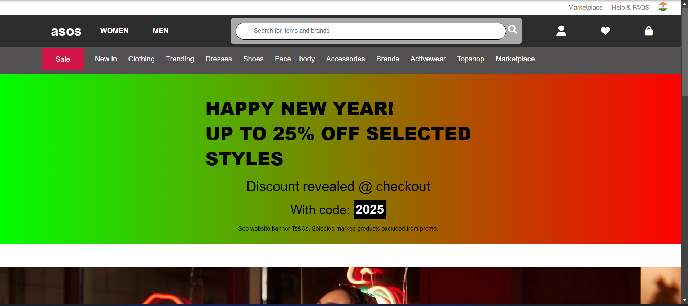
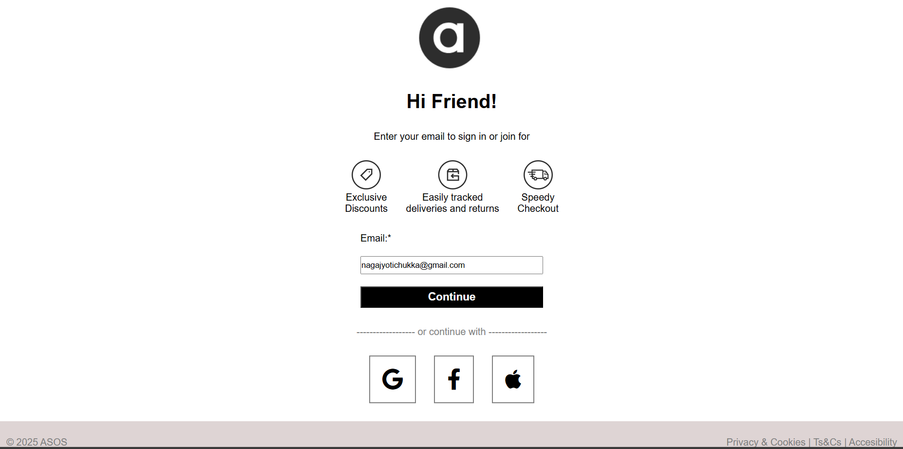

###  Project Name: Asos Project

#### This is a clone of the ASOS website, a popular British online retailer that specializes in fashion and cosmetics. The goal of this project is to replicate the core functionalities and layout of the ASOS site, providing users with an engaging e-commerce experience.

### Tech Stack Used: HTML/CSS/JAVASCRIPT

### Features working: Sign-in page for sending the data in the backend

### Deployed FrontEnd Link: [link](https://nagajyothichukka.github.io/Asos_Project/)

### Deployed  Backend Link: [link](https://quilted-helpful-niece.glitch.me)

### Screenshots

1. #### Home Page: 

2. ### Signin page: .png) 

3. ### Signin Page: 